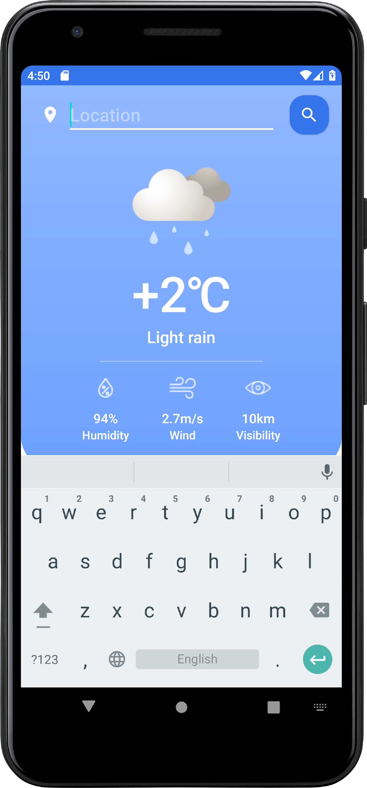

# Weather-Forecast-App

Weather forecast app for Android. I get weather data from the free API: <a href="https://openweathermap.org/api" target="_blank">OpenWeather</a>

By building this project I learned:
- work with public API
- use query and path parameters with Retrofit
- work with runtime permissions
- get user location
- use MockK

Location can be determined by accepting location permissions and turning on GPS. Alternatively, a user can enter the desired location manually.

